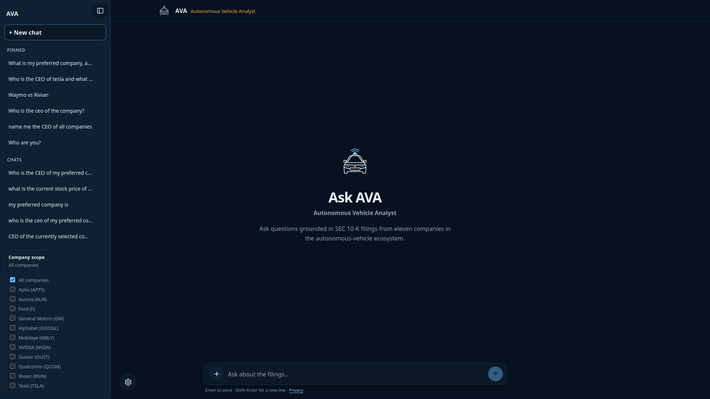
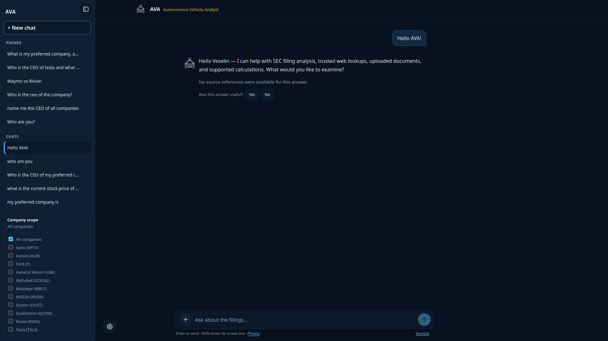
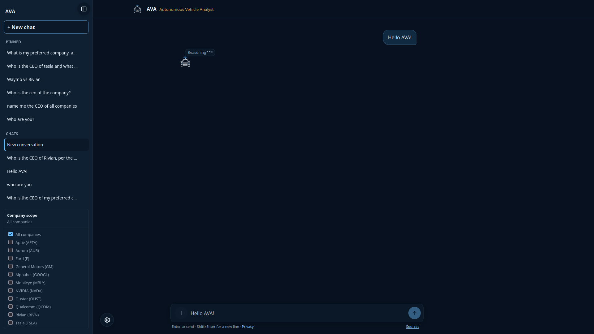
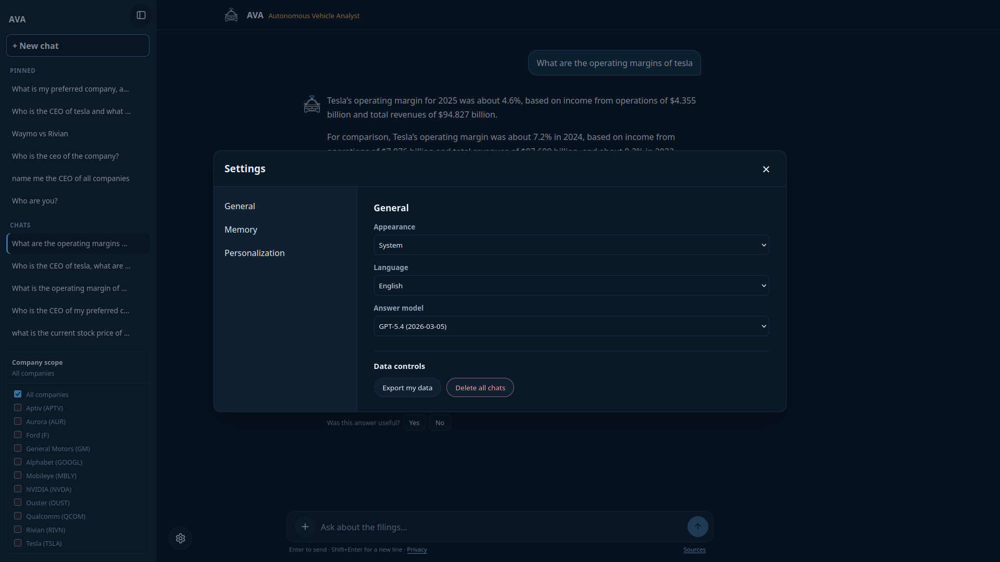
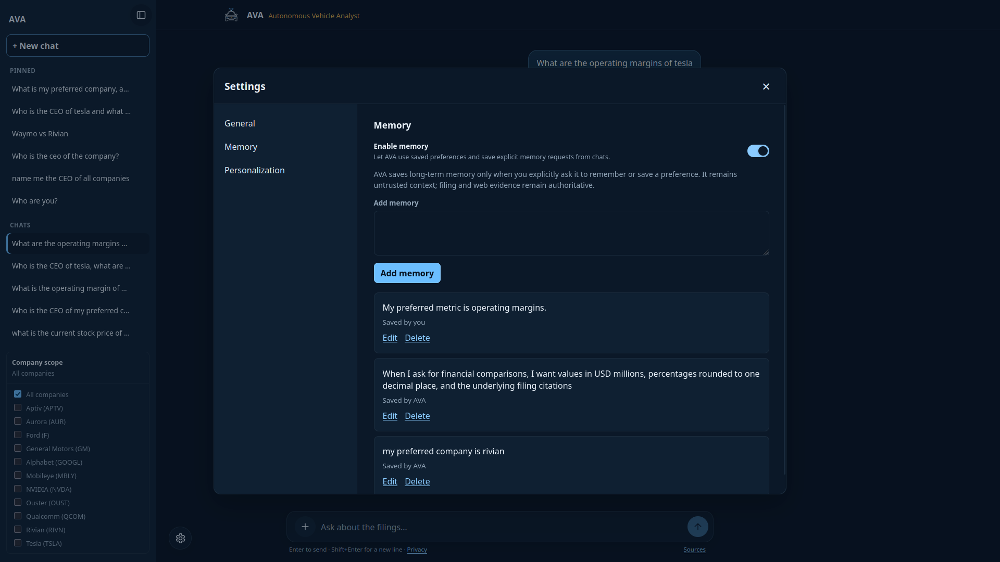
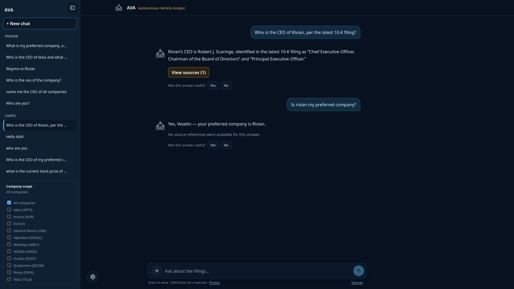
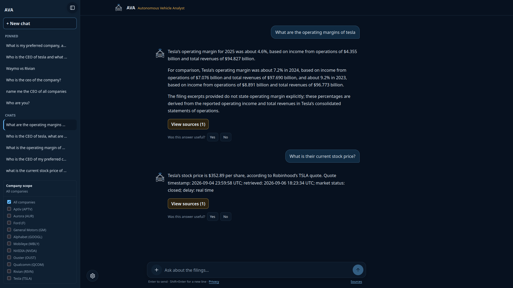

# AVA — Autonomous Vehicle Analyst

AVA is a browser-based Retrieval-Augmented Generation (RAG) assistant for
analyzing annual SEC filings from autonomous-driving and adjacent technology
companies. It was built to make answers useful, grounded, and inspectable:
AVA retrieves evidence from frozen filings, generates an answer from that
evidence, validates the citations, and shows only the sources that support the
answer.

This README is a project-level summary. The detailed Serbian technical report is
available in [FINAL_REPORT.md](FINAL_REPORT.md), which is the presentable record
of the architecture, implementation, evaluation, and limitations.


## Project goals

AVA was designed around four requirements:

1. Acquire annual reports reproducibly from SEC EDGAR.
2. Preserve useful filing structure, including sections, paragraphs, lists,
   tables, metadata, and source locations.
3. Retrieve the evidence required to answer a question and evaluate retrieval
   independently from generation.
4. Present a grounded answer with exact, user-visible references whenever the
   answer contains supported factual claims.

The project deliberately separates responsibilities:

- Retrieval finds filing, upload, or web evidence.
- Generation synthesizes only validated evidence and bounded user context.
- The calculator performs exact arithmetic with server-side `Decimal` code.
- Web search supplies freshness when the frozen filing corpus cannot answer a
  current question.
- Conversation history and long-term memory provide user context, not factual
  authority.
- The frontend displays answers, citations, tables, settings, and status, but
  does not decide company scope, retrieval policy, tools, or ownership.

## Frozen corpus

The active corpus is fixed to these eleven companies:

| Ticker | Company | Reporting period | Filing date |
|---|---|---:|---:|
| APTV | Aptiv PLC | 2025-12-31 | 2026-02-06 |
| AUR | Aurora Innovation, Inc. | 2025-12-31 | 2026-02-11 |
| F | Ford Motor Company | 2025-12-31 | 2026-02-11 |
| GM | General Motors Company | 2025-12-31 | 2026-01-27 |
| GOOGL | Alphabet Inc. | 2025-12-31 | 2026-02-05 |
| MBLY | Mobileye Global Inc. | 2025-12-27 | 2026-02-12 |
| NVDA | NVIDIA Corporation | 2026-01-25 | 2026-02-25 |
| OUST | Ouster, Inc. | 2025-12-31 | 2026-03-02 |
| QCOM | QUALCOMM Incorporated | 2025-09-28 | 2025-11-05 |
| RIVN | Rivian Automotive, Inc. | 2025-12-31 | 2026-02-12 |
| TSLA | Tesla, Inc. | 2025-12-31 | 2026-01-29 |

The promoted corpus contains:

- 12,602 structured document blocks;
- 1,005 physical HTML table fragments;
- 978 logical tables;
- 965 indexed table chunks and 13 retained-but-excluded navigation tables;
- 3,561 narrative chunks;
- 4,526 total retrieval chunks;
- 4,526 aligned, normalized 768-dimensional BGE-base v1.5 vectors.

These counts are recorded in the release artifacts and v19 freeze manifest. The
corpus is intentionally restricted to autonomous-vehicle manufacturers, sensing
companies, semiconductor vendors, and related technology companies so that
company comparisons are meaningful while the evaluation set remains bounded.
The scope must not be expanded or replaced without an explicit project decision.

## Filing acquisition and reproducibility

`src/filings/fetch_data.py` uses the SEC company-submissions API to locate the
latest normal `10-K` for each configured company and then downloads the SEC-hosted
primary filing HTML. `10-K/A` filings are treated as amendments and are not used
as the primary filing.

Each snapshot is stored as:

```text
data/raw/TICKER/YEAR-10-K.html
data/raw/TICKER/YEAR-10-K.metadata.json
```

Metadata includes the company, ticker, CIK, form, filing date, reporting period,
accession number, and exact SEC source URL. A descriptive `SEC_USER_AGENT` is
required. Existing raw files are not silently overwritten; acquisition and
processing are separate operations:

```text
download-latest
process-existing
```

Raw HTML is treated as immutable. All later outputs are derived under
`data/processed/`, `data/chunks/`, `data/embeddings/`, and `data/indexes/`.
The v19 release manifest stores hashes for raw metadata, processed blocks,
chunks, embeddings, evaluation manifests, prompts, migrations, dependencies,
and runtime configuration. This makes it possible to determine whether a change
came from acquisition, preprocessing, chunking, indexing, prompting, or code.

## HTML cleaning and structured parsing

AVA does not flatten an entire filing with one `get_text()` call. The parser
first creates an ordered, typed block representation so that document structure
survives retrieval and citation resolution.

The preprocessing pipeline is divided into focused modules:

| Module | Responsibility |
|---|---|
| `src/filings/filing_io.py` | Local filing discovery, HTML loading, and metadata validation |
| `src/filings/dom_processing.py` | DOM cleanup, whitespace normalization, page furniture, and heading signals |
| `src/filings/table_processing.py` | Physical table reconstruction, logical tables, headers, units, and classifications |
| `src/filings/block_extraction.py` | Ordered traversal, section state, and typed block emission |
| `src/filings/preprocess_filing.py` | Orchestration, validation, and atomic JSONL output |
| `src/filings/audit_tables.py` | Corpus and table-quality audits |

The cleaner removes scripts, styles, `noscript`, images/SVG content, HTML head
content, hidden Inline XBRL such as `ix:hidden`, and safely identifiable SEC
viewer/navigation material. Visible Inline XBRL wrappers are removed while their
visible text is preserved. HTML entities, non-breaking spaces, soft hyphens,
zero-width characters, and repeated whitespace are normalized.

The extractor preserves document order, headings, paragraphs, list items, tables,
section paths, filing metadata, source tags, anchors, and SEC URLs. It recognizes
SEC headings represented by styled or bold paragraphs, not only `h1` and `h2`
elements. Extraction begins at the actual Item 1 content where possible so that
cover-page and table-of-contents duplicates do not become the main document.

### Logical-table preservation

SEC tables are difficult to parse reliably. Real filings may use bold `td`
elements as headers, split currency symbols from values, include empty alignment
columns, use multi-row headers, or continue a logical table across physical HTML
fragments.

AVA therefore preserves two representations:

1. Immutable physical evidence: raw cells, coordinates, spans, formatting, DOM
   XPath, and HTML fingerprints.
2. A normalized logical table: title, section, header paths, row roles, units,
   column units, classifications, continuation links, and raw-cell mappings.

`rowspan` and `colspan` are expanded into a logical grid. Internal empty cells are
preserved so values do not move to the wrong column. A first plausible data row
is detected before constructing multi-row headers, while a four-digit year alone
is not treated as sufficient evidence of a data row. Tables are classified as
`data`, `text`, `navigation`, `list`, or `unknown`.

Navigation tables are retained in processed evidence but excluded from retrieval.
Uncertain tables are retained rather than silently discarded. This design was
introduced after Mobileye tables exposed errors such as data rows being promoted
to headers, years becoming column names, lost table titles, and mixed currency/
percentage units being assigned one global unit.

The authoritative cleaning and chunking record is
[CLEANING_AND_cHUNKING_REPORT_FINAL.md](CLEANING_AND_cHUNKING_REPORT_FINAL.md).
The current corpus audit records 1,005 valid table renderings, no unmapped
non-empty cells, no standalone marker columns, and 183 tracked normalization
fallbacks in the processed QA population. The chunk-scope population records 182
fallbacks; those two numbers intentionally are not merged.

## Chunking

Chunking is implemented in `src/chunking/chunk_documents.py` and occurs only after
structured extraction. The promoted configuration is:

| Parameter | Promoted value |
|---|---|
| Strategy | Recursive character splitting |
| Narrative size | 500 tokenizer tokens |
| Configured overlap | 32 tokenizer tokens |
| Separator priority | paragraph, line, space, character |
| Table policy | one complete retained logical table per table chunk |
| Schema | chunk-schema-v3 |

Narrative text is grouped within the same `section_path`. The section prefix is
included in the token budget. Recursive splitting prefers paragraph boundaries,
then line and word boundaries, and falls back to character boundaries only when
necessary. Every chunk keeps company, ticker, CIK, filing year/date, reporting
period, accession number, section, content type, source URL, block identity, and
source character/token spans.

The token benchmark compared recursive and fixed strategies on Mobileye and Tesla
at several sizes. All successful configurations had 100% source-block coverage,
100% section accuracy, and 100% table-context presence. On the recorded 500/64
comparison, Mobileye recursive splitting produced 468 chunks with 92.1% boundary
accuracy, while fixed splitting produced 433 chunks with 61.7%. Tesla recursive
splitting produced 343 chunks with 89.1%, while fixed splitting produced 334 with
66.9%. Recursive splitting was selected for better semantic boundaries.

The configured overlap and measured overlap are recorded separately. Separator-
aware splitting does not guarantee that 32 tokens are repeated in every adjacent
pair; natural boundaries often produce measured overlap of zero. Tables are exempt
from the narrative size limit. Each retained logical table remains complete in one
table chunk with its headers, rows, units, title, and source mapping. This avoids
requiring retrieval or the frontend to reconstruct a table from row fragments.

Chunk IDs depend on the chunking configuration. Historical character-based and
250-token results are preserved with their own gold mappings and must not be
compared as if they used the current chunk IDs.

## Embeddings

Embedding generation and auditing are implemented in `src/embeddings/`. The
project evaluated MiniLM and BGE-base, with support for additional local model
experiments. The selected baseline is:

| Setting | Value |
|---|---|
| Model | `BAAI/bge-base-en-v1.5` |
| Resolved revision | `a5beb1e3e68b9ab74eb54cfd186867f64f240e1a` |
| Dimension | 768 |
| Normalization | L2-normalized vectors |
| Query prefix | `Represent this sentence for searching relevant passages: ` |
| Document prefix | Empty |
| Manifest | manifest-v3 |

The embedding manifests record source hashes, model revisions, dimensions,
normalization policy, input lengths, truncation information, and vector alignment.
The promoted release has one valid vector for every promoted chunk.

On the saved 300-question corpus benchmark, the historical MiniLM dense run
recorded Recall@10 `0.5472` and MRR@10 `0.3171`. BGE-base dense retrieval
recorded Recall@10 `0.7072`, hit@10 `0.7967`, complete@10 `0.6167`, and MRR@10
`0.5168`. BGE was selected for retrieval quality despite its larger vector size
and compute cost.

## Retrieval and indexing

The active filing retrieval path is shared by the production API, the hybrid
retrieval notebook, and the scope-aware evaluation script. The relevant modules
are `src/retrieval/dense.py`, `src/retrieval/scope_aware.py`,
`src/retrieval/evidence_policy.py`, and `src/indexing/qdrant_index.py`.

The filing path is:

```text
original query
→ company/alias and Comparison Cue detection
→ bounded atomic subqueries
→ ticker-filtered dense and BM25 candidate pools
→ reciprocal-rank fusion
→ stable-ID merge and deduplication
→ balanced evidence allocation
→ token-aware final context packing
```

The server, not the frontend, decides company scope and retrieval policy. Each
relevant company/subquery has its own candidate pool. Selection retains at least
two available chunks per subquery, then fills remaining slots by fused score and
the `0.01` multi-subquery bonus. The policy allows at most 50 final chunks per
request and at most 10 per company. If the complete quota cannot fit because of
available evidence or token limits, AVA keeps balanced partial evidence instead
of discarding a supported company.

### Dense, lexical, and hybrid results

| Evaluation | Questions | Recall@10 | Hit@10 | MRR@10 | Status |
|---|---:|---:|---:|---:|---|
| MiniLM dense | 300 | 0.5472 | 0.6300 | 0.3171 | Historical baseline |
| BGE-base dense | 300 | 0.7072 | 0.7967 | 0.5168 | Selected dense baseline |
| BM25 | 300 | 0.7517 | 0.8400 | 0.5428 | Lexical comparison |
| BGE/BM25 RRF | 300 | 0.8117 | — | 0.6157 | Historical hybrid comparison |
| Scope-aware hybrid | 300 | 0.8411 | — | 0.6157 | Historical promoted comparison |

The saved summaries under `data/evaluation/dense_retrieval/` and
`data/evaluation/bm25_retrieval/` contain Recall, Hit, Complete, MRR, latency,
question-type, multi-chunk, table, narrative, and company breakdowns. The RRF
and scope-aware values are also summarized in `FINAL_REPORT.md`; they are
historical corpus comparisons and should not be confused with the later
planner/end-to-end gate.

Historical Mobileye-only results remain preserved. The 60-question dense baseline
recorded Recall@10 `0.6167`, MRR@10 `0.4446`, and hit rate `0.6833`. A separately
constructed 34-question subset recorded Recall@10 `0.7206`; because the query
sets differ, these are not interchangeable metrics.

### Qdrant and local parity

The v19 release uses Qdrant as the primary persistent filing vector store:

- Qdrant server `1.18.2`;
- Python client `1.19.0`;
- read alias `ava_filing_chunks_current`;
- physical collection `ava_filing_chunks_89d3a5be9e7d7a8e`;
- 4,526 points;
- 768 dimensions;
- Dot distance;
- deterministic point IDs and indexed payload fields.

Qdrant import and point-count audits passed. The local NPZ/BM25 path remains the
reproducibility and shadow/parity path. In primary mode, a configured Qdrant
failure makes readiness false; the application does not hide the failure by
returning mock answers.

The earlier P0 evidence-selection baseline had candidate recall `1.0` but final
recall `0.5887` because a fixed selector favored an imbalanced evidence set. The
company-balanced policy reached candidate recall `1.0`, final recall `1.0`, quota
satisfaction `1.0`, and source-display exactness `1.0` on that five-case frozen
gate. This is a small diagnostic gate, not a general corpus estimate.

## Grounded generation and citations

Generation is separated into prompts, provider behavior, service logic, citation
handling, and orchestration. The main modules are:

- `src/generation/prompts.py`;
- `src/generation/provider.py`;
- `src/generation/service.py`;
- `src/generation/citations.py`;
- `src/orchestration/task_execution.py`.

The grounded prompt labels filing excerpts as untrusted evidence and labels
conversation context and recalled memory as untrusted user context. It requires
each factual claim to have an exact citation ID in square brackets. The server
resolves citations against exactly the final generation context. Unknown,
malformed, or unused IDs are rejected. If no citation resolves, the API returns
an empty source list instead of falling back to all retrieved evidence.

Tables remain structured through the backend and frontend. The UI receives
validated headers, rows, and units and never reconstructs a table from Markdown.
The prompt also distinguishes periods, currencies, units, totals, subtotals,
percentages, and changes. Unsupported portions of a multi-part question are
identified rather than filled with model knowledge.

The generation evaluator distinguishes deterministic citation/source contracts,
reviewed human labels, and diagnostic LLM judgments:

| Layer | Recorded result | Interpretation |
|---|---|---|
| Oracle-context, 75 cases | invalid citations 0; source-display exactness 1.0; abstention accuracy 0.9067 | Generation contract with fixed evidence |
| Real end-to-end GPT-4o judge, 225 records | correctness 0.8133; faithfulness 0.8000; citation support 0.7956; abstention 0.7600; relevance 0.8356; conciseness 0.8178 | Diagnostic judge only |
| Single-human blinded review, 20 pairs | correctness, faithfulness, citation support, abstention, relevance 1.0; conciseness 0.9 | Provisional human review; one reviewer |

The human packet did not provide two independent reviewers or complete-excerpt
certification. The diagnostic judge therefore does not override deterministic
checks or human labels.

The configured gateway may return buffered JSON rather than genuine provider
streaming. In that mode AVA sends one completed `delta` SSE event and does not
simulate typing. When genuine provider streaming is available, the backend can
forward actual fragments while filtering citations incrementally.

## Bounded routing and planning

AVA is not an open-ended autonomous agent. The final architecture uses one bounded
LLM JSON planner followed by deterministic server validation and execution. The
planner resolves intent and decomposes a request; it cannot execute arbitrary
code, select arbitrary URLs, access storage, or bypass ownership checks.

[DIAGRAM PLACEHOLDER: bounded planner routing filing, upload, web, memory, and calculator tasks]

The planner can produce finite tasks for:

- filing retrieval;
- owner/chat-scoped upload retrieval;
- trusted web search;
- evidence-backed or direct calculation;
- conversation-only responses;
- clarification.

The plan preserves the original user query, includes typed memory references and
dependencies, and is capped at four tasks with bounded web/tool counts. The
server validates task IDs, dependencies, canonical tickers, source keys, URLs,
memory ownership, budgets, ambiguity, and allowed task combinations. Only narrow
presentation normalizations are accepted, such as one outer JSON Markdown fence;
arbitrary planner fields are not repaired.

This architecture replaced multiple independent route checks because they caused
lost companies in comparisons, discarded halves of mixed filing/web requests,
under-specified web follow-ups, ambiguous pronoun failures, and memory conflation.
Fixes include typed company relationships, singular-pronoun context from a
validated preceding answer, explicit handling of `both`, upload pre-search with
relevance checks, possessive ticker handling, product aliases, and safe plan
normalization.

The v18 route/tool manifest contains 60 cases and passed 60/60: route accuracy
`1.0`, web-required recall `1.0`, unnecessary web-call rate `0`, and calculator
false positives `0`. Remaining limitations include ambiguous follow-ups,
malformed provider plans, and trusted evidence that may be unavailable even when
the intent is clear.

## Web search and calculator

`src/tools/web_search.py` implements the provider-neutral Tavily adapter. Web is
a freshness tool of last resort: ordinary questions about a frozen filing remain
filing questions, while current leadership, current prices, current news,
regulatory updates, or explicit online requests can require web evidence.

The planner selects reviewed source keys rather than arbitrary domains. The source
registry includes SEC, official issuer, NHTSA, exchange, Robinhood, and Reuters
categories. Ticker-aware rewriting turns an underspecified follow-up into a
targeted query such as `TSLA current stock price`. Results are screened for
approved HTTPS hosts. Redirects are not followed automatically; local/private
addresses, unsafe ports, credentials, and invalid URLs are rejected. Returned
web text is untrusted data and is quarantined at the provider boundary.

Market quotes require a qualifying result, source and retrieval timestamps,
market status, and disclosed delay. If no qualifying result exists, AVA reports
that verification failed rather than substituting a stale filing or unrelated
article. A live Tavily smoke test returned allowlisted Tesla investor-relations
results, and the v18 route manifest verified web-required routing.

`src/tools/calculator.py` is a deterministic Decimal expression evaluator. It
does not evaluate Python or arbitrary code and limits expression size, nesting,
operations, and decimal precision. It supports genuine arithmetic and
evidence-derived calculations only. Repetition, enumeration, name/letter
manipulation, string operations, and copying a reported number are not calculator
tasks. The saved Phase 10 calculator regression passed 10/10 with exactness 1.0.

Provider-native function calling is not required. The application uses a typed
Python executor because the configured provider capability probes showed that
ordinary chat/streaming behavior and strict JSON/native-function support can
vary by gateway and model.

## Conversation history, uploads, and memory

PostgreSQL is the canonical store for owner-scoped tenants, users, conversations,
messages, summaries, source uses, feedback, pins, company scope, preferences,
uploads, and authentication sessions. Ownership is enforced server-side; browser
state is not a trust boundary.

Short-term context is bounded and extractive. The context builder groups complete
turns, excludes the active turn, accounts for tokens, selects newest eligible
turns, skips oversized turns, and restores chronological order. Conversation
context is explicitly labeled as context rather than evidence.

Long-term memory is a separate semantic Qdrant collection. The v19 configuration
uses five candidates, a similarity threshold of `0.55`, and a 1,024-token memory
budget. PostgreSQL remains the source of truth; Qdrant is a derived index that is
updated on create/edit/delete and can be reconciled. Memory writes are explicit
and opt-in for stable user preferences or profile details. Typed relationships
such as preferred company, favorite CEO, metric, and product are kept distinct.
Memory may resolve a user reference, but it may never establish a CEO, revenue,
vehicle, filing, or market fact.

The saved v18 conversation evaluation recorded query-only planner accuracy
`0.6667`, contextual accuracy `0.8889`, history-dependent contextual accuracy
`1.0`, a history improvement delta of `1.0`, standalone contextual accuracy
`0.75`, and topic-switch contextual accuracy `1.0`. Deletion and cross-user/
cross-conversation isolation cases passed.

`src/documents/` handles conversation-scoped PDF and text uploads. Original bytes
and extracted source text are preserved. Upload chunks are indexed in an isolated
owner/chat-filtered Qdrant collection and displayed as upload sources. Upload
pre-search must find a meaningful lexical/semantic bridge before it can pre-empt
an unrelated filing request. Instruction-like text is quarantined only in the
provider-facing excerpt; the original source remains available for display.

## Frontend

The frontend is a React + TypeScript Vite application under `src/frontend/`.
It provides:

- responsive desktop and mobile layouts;
- light and dark themes;
- canonical AVA avatar and supplied favicon assets;
- accessible semantic controls, focus states, keyboard navigation, and reduced-
  motion support;
- English and Serbian UI language selection;
- answer-model selection;
- company-scope selection;
- recent and pinned conversation sidebar;
- Settings for General, Memory, and Personalization;
- explicit memory editing/deletion controls;
- PDF and pasted-text upload flows;
- structured narrative, table, upload, and web source cards;
- citations and source panels;
- thinking/status events and safe error messages;
- real SSE consumption without fake typing.

The frontend sends the original query unchanged. It does not perform company
detection, planner execution, retrieval, citation resolution, tool execution, or
ownership decisions. Markdown is rendered without unsanitized HTML. Raw internal
chunk IDs, retrieval scores, prompts, provider errors, and secrets are excluded
from normal browser responses.

The supplied visual assets are used without destructive modification:
`src/frontend/avatar/ava.png`, `src/frontend/avatar/ava-light.png`,
`src/frontend/avatar/ava-dark.png`, and `src/frontend/avatar/favicon.png`.

## Screenshots

The repository includes the following captured application states:

### Empty AVA home page



The initial state shows the AVA workspace before a conversation has started.

### Greeting and conversation start



This screenshot shows the initial conversational interaction and assistant
identity.

### Reasoning / request in progress



`in_progress.png` captures the reasoning/status state while AVA is processing a
request. It is a presentation state, not a disclosure of the hidden system
prompt or internal chain-of-thought.

### General settings



The General settings view contains appearance, language, and answer-model
preferences.

### Memory settings



The Memory settings view exposes user-controlled long-term memory management.
Memory remains owner-scoped and is not treated as SEC evidence.

### Cited filing answer



This state demonstrates an answer grounded in filing evidence and presented with
its corresponding source information.

### Current web answer



This state demonstrates a current-information request using the bounded trusted
web route and web-source presentation.

## Deployment

The local stack consists of:

```text
Vite frontend → FastAPI backend → PostgreSQL + Qdrant
                                  ↘ SEC retrieval / Tavily / model provider
```

`start_app.sh` starts loopback PostgreSQL and Qdrant, applies/checks migrations,
initializes and audits the filing index when necessary, waits for API readiness,
and starts the Vite frontend. Open `http://localhost:5173`.

The pinned local services are Qdrant server `1.18.2` and PostgreSQL as configured
by the Compose files. The API can also be started directly:

```bash
.venv/bin/uvicorn src.backend.app:app --reload --port 8000
```

The frontend can be started separately:

```bash
cd src/frontend
npm install
npm run dev
```

Important backend-only configuration includes:

```dotenv
AVA_PIPELINE_MODE=real
AVA_LLM_MODEL=AZURE_GPT_4o_2024_1120
AVA_REQUEST_ROUTING_ENABLED=true
AVA_QDRANT_MODE=primary
QDRANT_URL=http://127.0.0.1:6333
QDRANT_COLLECTION_ALIAS=ava_filing_chunks_current
AVA_CONVERSATION_MODE=single_user
AVA_SINGLE_USER_BOUNDARY_ACKNOWLEDGED=true
AVA_POSTGRES_DSN=postgresql://ava:<password>@127.0.0.1:5432/ava
OPENAI_API_URL=<backend-only-compatible-gateway>
OPENAI_API_KEY=<backend-only-secret>
TAVILY_API_KEY=<backend-only-secret-when-enabled>
```

Never expose provider keys or gateway headers through `VITE_*` variables. The
single-user mode is an explicit local boundary, not a substitute for production
multi-user identity. Production deployment requires OIDC configuration, HTTPS,
secure cookies, CSRF protection, private PostgreSQL/Qdrant networking, rate
limits, secret rotation, backups, restore drills, and container/dependency scans.

See the Deployment, Security, and Observability sections of
[FINAL_REPORT.md](FINAL_REPORT.md) for the presentable operational summary.

## Observability and security

Every real pipeline request produces one backend-only structured request record.
`src/observability/request_trace.py` records the corpus/index version, original
query, resolver decision, subqueries, candidate provenance, evidence allocation,
final evidence, answer, citations, source-display status, stage latency, time to
first token, provider usage when available, cancellation, and a redacted error
class. The browser receives only an opaque request ID.

The security model treats SEC text, uploads, web excerpts, memory, conversation
context, and model output as untrusted at their respective boundaries. Controls
include:

- server-owned tenant/user and conversation predicates;
- mandatory Qdrant ownership filters for memory and uploads;
- exact citation validation;
- fixed frontend-safe source schemas;
- React Markdown with HTML disabled;
- SSRF and redirect protections for web results;
- upload quarantine and size limits;
- bounded query, evidence, history, tool, retry, and timeout budgets;
- safe browser errors without prompts, keys, stack traces, or provider internals;
- access-controlled logs and configured retention;
- deletion/reconciliation checks across PostgreSQL and derived Qdrant state.

## Evaluation and verification

Evaluation is separated into retrieval quality, generation quality, routing/tool
correctness, memory/history behavior, security, latency, and frontend contracts.
The major saved evaluation groups are:

| Area | Saved coverage |
|---|---|
| Corpus retrieval | 300-question dense and BM25 benchmarks with Recall, Hit, Complete, MRR, category, company, table/narrative, multi-chunk, and latency breakdowns |
| QA/generation | 75 reviewed cases across factual, synthesis, comparison, table, absent, follow-up, calculation, alias, and current-web categories |
| Route/tool behavior | 60 reviewed route/tool cases, including filing, web, calculator, upload, conversation, and false-positive traps |
| Conversation/history | Follow-ups, old-turn recall, topic switches, summaries, deletion, and isolation |
| Memory | Explicit saves, summaries, edits, deletes, relevance, stale-fact rejection, and owner isolation |
| Security | Direct injection cases plus document-boundary and web-boundary tests |
| Language | 10 paired English/Serbian prompts for resolution, route, retrieval, numbers, and citations |
| Frontend | Lint, TypeScript, Vitest/component tests, production build, API/SSE/source contracts |

The latest v19 release ledger records focused backend `151 passed`, frontend
lint passed, frontend `43` tests passed, TypeScript passed, production build
passed, route/tool manifest `60/60` passed, conversation-history gate passed,
and freeze-manifest validation passed. The completed router-refactor handoff
also records `446 passed, 3 skipped, 267 subtests`; skipped tests are explicit
external-service integrations.

The v1 frozen end-to-end baseline is retained because it explains the fixes that
led to v19. Its three real runs recorded mean route accuracy about `0.90` before
the later planner corrections, current-web execution success `0.60`, and
calculator execution `0` because that runtime deliberately disabled the tool.
Those values are historical baseline measurements, not current v19 claims.

Run the ordinary backend suite with:

```bash
.venv/bin/python -m unittest discover -s tests -v
```

Useful data-generation and audit commands include:

```bash
.venv/bin/python -m src.filings.fetch_data
.venv/bin/python -m src.filings.preprocess_filing mobileye
.venv/bin/python -m src.chunking.chunk_documents mobileye --overwrite
.venv/bin/python -m src.embeddings.embed_chunks mobileye --device cpu
.venv/bin/python -m src.filings.audit_tables --strict
.venv/bin/python -m src.embeddings.audit_embeddings --strict
```

The release freeze can be validated with the repository’s freeze evaluator. The
exact source commit, artifact hashes, model revision, prompts, trusted-source
registry, Qdrant state, and runtime configuration are recorded in
`data/evaluation/finalization/v19/freeze_manifest.json`.

## Architectural decisions

The project makes the following deliberate trade-offs:

| Decision | Why it was selected | Cost or limitation |
|---|---|---|
| SEC-hosted HTML | Canonical source and better structural provenance than a secondary copy | SEC HTML layouts are irregular |
| Immutable raw snapshots | Reproducible processing and valid before/after comparisons | New filings require a deliberate new snapshot |
| Structured blocks | Retains section, order, tables, and source locations | More preprocessing logic than plain text |
| Logical-table schema | Preserves headers, units, rows, and full-table context | Some tables are larger than narrative chunks |
| Recursive token chunking | Better semantic boundaries than fixed splitting | Actual overlap is data-dependent |
| BGE-base v1.5 | Better saved dense retrieval quality than MiniLM | Larger 768-dimensional vectors and compute cost |
| BM25 + RRF | Lexical matching complements semantic retrieval | Requires a second index and fusion policy |
| Qdrant | Persistent vector service with payload filtering and aliases | Adds operational and parity requirements |
| FastAPI + React | Thin API adapter and accessible browser product | More deployment components than a notebook |
| PostgreSQL history | Server-owned persistence and deletion semantics | Database lifecycle and retention work |
| Semantic memory | Efficient preference/reference recall without full transcript injection | Derived, untrusted context can still be ambiguous |
| Decimal calculator | Exact arithmetic without trusting model arithmetic | Only allow-listed genuine calculations are supported |
| Trusted Tavily sources | Freshness with reviewed domains and URL controls | Results depend on provider availability and timestamps |
| Bounded planner | Supports mixed tasks while preventing arbitrary agent behavior | Planner output can be malformed or ambiguous |
| Evidence-first generation | Makes claims traceable and supports abstention | Larger contexts and additional latency |

Graph RAG, unrestricted autonomous agents, arbitrary code execution, trading
actions, and unmeasured visual features are outside the frozen scope.

## Known limitations and future work

The frozen release has the following known limitations:

- Some ambiguous planner follow-ups may be rejected rather than guessed.
- Trusted web answers depend on qualifying provider results and timestamps.
- The configured gateway may deliver buffered answers instead of genuine token
  streaming.
- Serbian citation-ID parity is `0.8` in the saved ten-pair evaluation, while
  company resolution, route, gold recall, and numerical parity are `1.0`.
- Evaluation sets are deliberately small and some human review has only one
  reviewer.
- The current table parser does not infer tables from visually aligned prose;
  some continued physical HTML tables may remain separate.
- Qdrant and PostgreSQL deletion are not one distributed transaction and require
  reconciliation procedures.
- Image ingestion and retrieval were explicitly skipped.
- Production multi-user OIDC, retention automation, and horizontal/global rate
  limiting require deployment-specific completion.

Authorized future work includes stronger planner context resolution, typed memory
references, better mixed-source planning, stronger quote providers, measured
cross-encoder reranking, improved multilingual retrieval, larger evaluation sets,
concurrency-safe model selection, richer source editing, and UI polish. These are
proposals or post-release work, not claims about the frozen release.

## Repository map

```text
data/raw/          immutable SEC HTML and metadata
data/processed/    structured block JSONL and QA artifacts
data/chunks/       chunk-schema-v3 retrieval chunks
data/embeddings/   NPZ vectors and embedding manifests
data/indexes/      Qdrant import/index artifacts
data/evaluation/   frozen datasets, manifests, runs, and reports
src/filings/       SEC acquisition, DOM parsing, tables, and corpus registry
src/chunking/      token-aware recursive chunking and benchmarks
src/embeddings/    embedding generation and audits
src/retrieval/     dense, BM25, hybrid, scope, and evidence policy
src/indexing/      Qdrant import and index management
src/generation/    prompts, provider adapter, grounding, and citations
src/orchestration/ bounded plans, routes, handlers, and task execution
src/conversations/ PostgreSQL history, summaries, memory, and migrations
src/documents/     PDF/text upload extraction, ownership, and retrieval
src/tools/         Decimal calculator and Tavily web search
src/backend/       FastAPI application and API routes
src/frontend/      React/TypeScript application and AVA assets
tests/             unit, integration, contract, security, and evaluation tests
```

Older plans, reports, and implementation notes are retained locally for
historical development context but are intentionally not part of the presentable
GitHub documentation. Use `FINAL_REPORT.md`, current source code, and saved
evaluation artifacts for the public project description.
