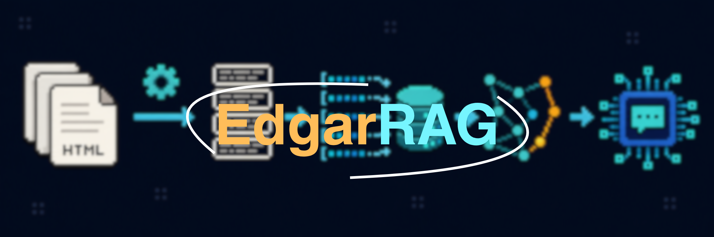

# AVA — Autonomous Vehicle Analyst



A Retrieval-Augmented Generation assistant for annual SEC filings. AVA downloads
the latest normal 10-K filings, preserves source HTML, extracts structured
document blocks, and uses those blocks for scope-aware retrieval and grounded
answers with citations.

## Current status

Implemented:

- SEC submissions lookup and latest normal `10-K` selection
- local HTML and acquisition metadata storage
- HTML cleanup with visible Inline XBRL text preserved
- extraction of Item sections, headings, paragraphs, lists, and tables
- table-schema-v2 extraction with immutable physical DOM evidence and validated
  logical rows, columns, headers, units, titles, regions, and continuations
- deterministic JSONL block output with filing metadata and source anchors
- token-based recursive narrative chunking with source-block provenance
- one complete included logical table per chunk; navigation tables remain in
  processed evidence and produce no chunks
- processed block output for the approved ten-company corpus
- aligned chunk-schema-v3 500-token/32-token output for all ten companies
- dynamically selected local embedding models with normalized vectors and reproducibility manifests
- aligned 768-dimensional BGE-base v1.5 manifest-v3 embeddings for all ten
  promoted chunk files
- versioned Mobileye gold-v2 labels and a post-migration semantic baseline
- corpus-wide scope-aware hybrid BGE/BM25 retrieval with reciprocal-rank fusion
- regex company, ticker, alias, Comparison Cue, and multi-company scope handling
- cross-encoder reranking and a fixed 12-chunk grounded generation context
- backend citation resolution and narrative/table-schema-v2 source adaptation
- FastAPI liveness/readiness and streamed POST/SSE endpoints
- React + TypeScript AVA interface with real stream consumption, structured HTML
  table sources, accessibility, responsive layout, and light/dark themes
- deterministic mock streaming for normal, pre-token-error, and partial-error UI testing

Not implemented yet:

- persistent vector database (the local vertical slice intentionally uses aligned NPZ artifacts)
- native provider token streaming through the currently configured gateway
- persistent conversation history, authentication, accounts, and uploads
- generation evaluation

The `table-v2-chunk-v3.20260813-r2` table repair release was promoted on 13
August 2026. Its live audit contains 11,440 blocks, 889 logical tables, and
4,115 chunks (3,238 narrative and 877 table); all ten BGE-base artifacts contain
matching vectors. There are no
normalization collisions, unmapped non-empty cells, standalone marker columns,
unknown tables, invalid table Markdown, or provenance gaps.

The local real pipeline loads and completes scope-aware retrieval/reranking, but
the configured OpenAI-compatible gateway currently answers `stream=True` with
HTTP 201 JSON and zero SSE chunks. AVA rejects that response rather than faking
typing. Use mock mode for frontend development until native gateway streaming is
enabled; see [DEPLOYMENT.md](DEPLOYMENT.md) for the verified contract and blocker.

See [ARCHITECTURE.md](ARCHITECTURE.md) for module and data contracts and
[ROADMAP.md](ROADMAP.md) for verified progress and current gates.

## Data flow

```text
SEC EDGAR API
  -> frozen filing HTML and metadata
  -> physical table evidence + logical table-schema-v2 blocks
  -> chunk-schema-v3 logical-table chunks
  -> manifest-v3 BGE-base embeddings
  -> vector retrieval
  -> grounded conversational answers
  -> separate retrieval and generation evaluation
```

Raw filing files under `data/raw/` are treated as immutable. Processed outputs are
written separately under `data/processed/`.

## Requirements

- Python 3.12
- `lxml`
- `python-dotenv`
- `langchain-text-splitters`
- `sentence-transformers`
- Node.js 22 and npm 10 for the AVA frontend

Install dependencies with `.venv/bin/pip install -r requirements.txt`.

On Linux, the requirements select CPU-only PyTorch from the official PyTorch
package index. Replace that requirement intentionally if GPU inference is needed.

Set an SEC-compliant user agent in `.env`:

```dotenv
SEC_USER_AGENT="Application Name contact@example.com"
```

For the local AVA API, also configure backend-only generation values:

```dotenv
AVA_PIPELINE_MODE=real
AVA_LLM_MODEL=AZURE_GPT_4o_2024_1120
OPENAI_API_KEY=<backend secret>
OPENAI_API_URL=<OpenAI-compatible gateway base URL>
```

Optional gateway headers retain the notebook names `OPENAI_APP_ID`,
`OPENAI_USER_ID`, `OPENAI_COMPANY_ID`, and `OPENAI_API_VERSION`. Never expose
these values through a `VITE_*` variable.

Start the API from the repository root:

```bash
.venv/bin/uvicorn src.backend.app:app --reload --port 8000
```

For deterministic frontend development while provider streaming is unavailable:

```bash
AVA_PIPELINE_MODE=mock .venv/bin/uvicorn src.backend.app:app --reload --port 8000
```

Start the frontend in another terminal:

```bash
cd src/frontend
npm install
npm run dev
```

The frontend defaults to `http://localhost:8000`; set the public
`VITE_API_BASE_URL` at build time when using another API origin.

## Usage

Download the latest configured 10-K filings:

```bash
.venv/bin/python -m src.filings.fetch_data
```

Existing filing snapshots are not overwritten by default.

Process an existing filing, for example Mobileye:

```bash
.venv/bin/python -m src.filings.preprocess_filing mobileye
```

Rebuild an existing processed output intentionally:

```bash
.venv/bin/python -m src.filings.preprocess_filing mobileye --overwrite
```

Create retrieval chunks from processed blocks:

```bash
.venv/bin/python -m src.chunking.chunk_documents mobileye --overwrite
```

The active configuration is recursive 500-token narrative chunks, 32-token
configured overlap, and one complete table per table chunk.

Embed the chunks with BGE-base v1.5, the default model:

```bash
.venv/bin/python -m src.embeddings.embed_chunks mobileye --device cpu
```

Select another supported model with `--model-name`:

```bash
.venv/bin/python -m src.embeddings.embed_chunks mobileye --model-name mpnet --device cpu
.venv/bin/python -m src.embeddings.embed_chunks mobileye --model-name bgebase --device cpu
.venv/bin/python -m src.embeddings.embed_chunks mobileye --model-name nomic --device cpu
```

The available names are `minilm`, `mpnet`, `bgebase`, and `nomic`; `bgebase` is
the default. Only the selected model is loaded.

Benchmark one model and update `EMBEDDING_REPORT.md`:

```bash
.venv/bin/python -m src.embeddings.benchmark_embeddings --model-name bgebase --device cpu
```

Each call replaces the existing result for that model and chunk-file version,
or adds a new row. The benchmark records model loading and encoding time,
throughput, query latency, dimensions, memory size, input lengths, and
truncation. Run the command separately for each model so only one is loaded at
a time.

The embedding command writes normalized vectors to a compressed NumPy file and
a JSON manifest containing the source hash, exact model revision, dimensions,
normalization policy, and any inputs truncated by the model.

Run tests:

```bash
.venv/bin/python -m unittest discover -s tests -v
```

Run the strict live table and embedding audits:

```bash
.venv/bin/python -m src.filings.audit_tables \
  --processed-directory data/processed --chunks-directory data/chunks \
  --input-manifest data/manifests/table-v2-inputs.json \
  --review-decisions data/manifests/table-v2-manual-review.json \
  --measure-embedding-tokens --strict

.venv/bin/python -m src.embeddings.audit_embeddings \
  --input-manifest data/manifests/table-v2-inputs.json --strict
```

## Data layout

```text
data/
  raw/
    MBLY/
      2025-10-K.html
      2025-10-K.metadata.json
  processed/
    MBLY/
      2025-10-K.blocks.jsonl
      2025-10-K.blocks.qa.json
  chunks/
    MBLY/
      2025-10-K.chunks.jsonl
      2025-10-K.chunks.stats.json
  embeddings/
    MBLY/
      2025-10-K.bgebase.embeddings.npz
      2025-10-K.bgebase.embeddings.manifest.json
  manifests/
    table-v2-release.json
    table-v2-live-validation.json
    table-v2-embedding-release.json
  evaluation/
    mobileye_retrieval_gold_v2.json
    mobileye_bgebase_table_v2_baseline.json
```

Generated `.npz` vectors are ignored by Git; manifests remain available for
reproducibility. A future indexing stage will add `data/indexes/`.

## Evaluation direction

Retrieval and answer generation are evaluated separately. The authoritative
Mobileye gold-v2 file preserves all 60 historical questions and maps 102 evidence
items through source blocks and logical-table identities. The post-migration
BGE-base run records Recall@10 and MRR overall and by evaluation set, category,
and evidence type. The historical 34-question comparison subset is unchanged at
mean Recall@10 0.721 (exactly 0.720588); its single-narrative, single-table, and
multi-chunk values remain 0.833, 0.625, and 0.5625. All incomplete retrievals are
reviewed in `data/evaluation/mobileye_bgebase_table_v2_review.json`.

## Reference

- [SEC EDGAR APIs](https://www.sec.gov/search-filings/edgar-application-programming-interfaces)
